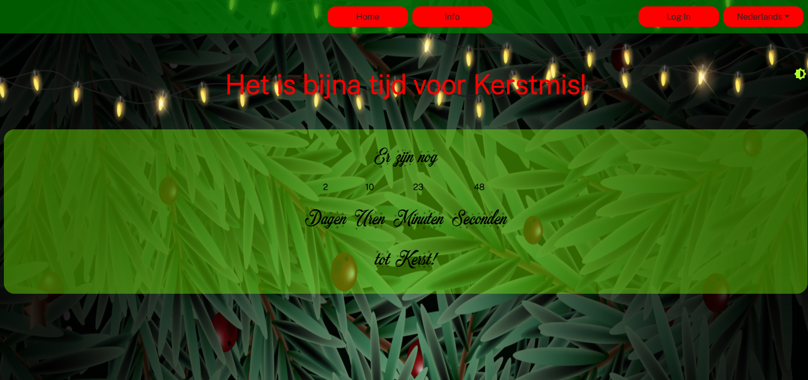
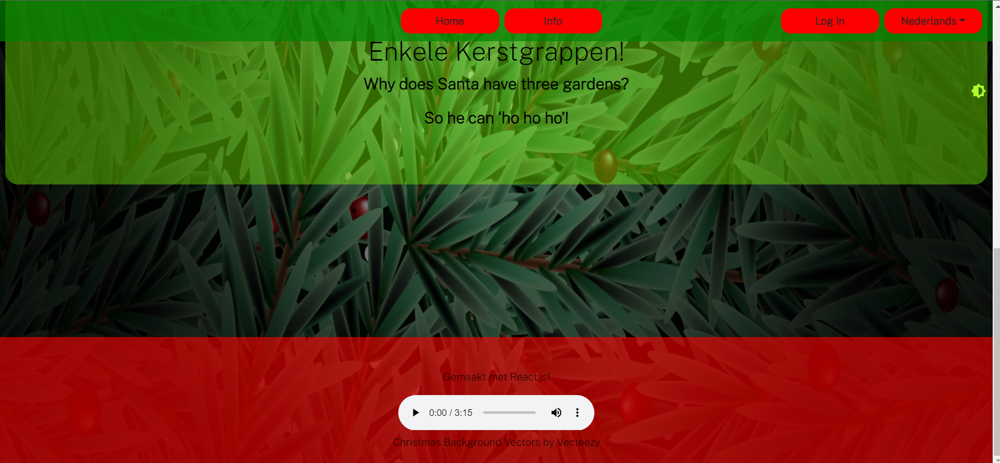

## Projectbeschrijving

Het onderwerp van dit project is secret santa. Mensen komen samen in een groep om namen te trekken. Voor de getrokken persoon wordt een cadeau gekocht.

Hieronder het ERD:

## Screenshots

## Gekende bugs

### Front-end Web Development

Geüploade images worden te snel verwijdert.

Background image repeat zichzelf wanneer de pagina te lang wordt (staat momenteel op round in css).

### Web Services

Wanneer iemand images upload zullen deze verdwijnen de volgende keer de server opstart. Het free plan van render biedt geen persistente opslag van images.

